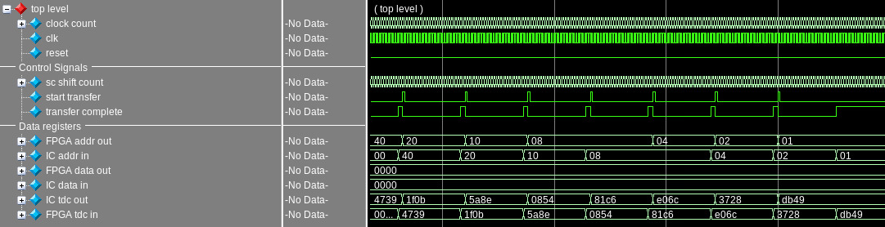
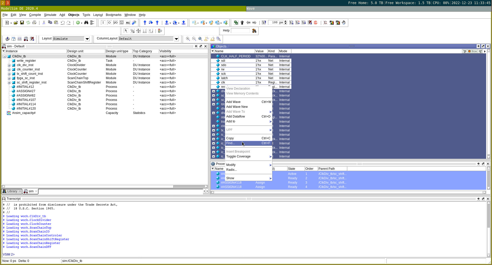

# Making Modelsim plots with tcl
When I started dabbling in digital design, I found myself constantly fighting Modelsim and having to rearange the waveforms that I was trying to plot in my design. This lead me to try and find a way to programatically plot and group waveforms so that every time I wanted to change things up slightly, it would be easy to get back to my initial state. It turns out that Modelsim allows for plotting waveforms from the tcl command line; therefore we can use a script to group and label waveforms from a variable that we can define.

The following figure shows an example of a set of waveforms that were inserted programatically. 

The rest of this document describes how this can be acomplished.

## The `add wave` command
ModelSim defines the `add wave` tcl command that we can use to plot signals from tcl. Note that full documenation of this command is avalible in the ModelSim manual, this guide will just provide an overview of the subset of options that I generally use. 

The `add wave` command takes a variety of parameters for input, but it requires at least one parameter, the name of a signal to plot. The signal name takes the form of a path to the `wire` or `reg` to be plotted in the design with `sim:` prepended to the front. For example, to plot the signal `clk` in a testbench named `ScanChainTop_tb` the path would take the form `sim:ScanChainTop_tb/clk`. By default, the waveform will be given the same name as the selected signal (including the path).

An example for using `add wave` is demonstrated in the code snippet below:
```tcl
# Display the clk signal from a testbench
add wave sim:/ScanChainTop_tb/clk
```
Each call to the `add wave` command will append the supplied waveforms to the end (bottom) of the list of waveworms to plot. (TODO: Check if it always appends to the end, or just after the currently selected waveform)

Plotting data buses is similarly easy, simply add the path to the name of the bus, and all of the constituent signals will be added as a group.

If we want to display more than one signal at the same time, we can just append more signals at the end of the command. For example, if we wanted to add a global reset signal, and a data bus we could use the following command.

```tcl
# Plot clock, reset, and data bus signals
add wave sim:/ScanChainTop_tb/clk \
    sim:/ScanChainTop_tb/reset \
    sim:/ScanChainTop_tb/data_bus
```
In this example we split the command over several lines by using the `\` character as the last element in the line.

### Getting Waveform Names From the GUI
While it is possible to remember the paths to each of the signals to plot, it can be helpful to use the GUI to look through each of the signals, then select and copy more than one at a time. Luckily, ModelSim lets us do that. Once a simulation has been started, a list of avalible signals is viewable in the modelsim window. Copying these signals (via the context menu, or `Ctrl+C`) will copy a list of the signal names into the clipboard, where we can paste them into a text editor for our use in scripts.

The following figure demonstrates copying a selected list of signals from the ModelSim environment using the context menu.


### Naming Signals
If we want to change the name displayed for the signal to something shorter or more descriptive, we use the `-label` option for `add wave`. This option requires two parameters to follow it: 
1. What to display for the signal name
2. The path to the signal to display

i.e `-label "signal name" signal_path`

We will plot our clock signal with a more descriptive label in the following code snippet:
```tcl
# Plot the clk signal with a more describtive title.
add wave -label "Global Clock" sim:/ScanChainTop_tb/clk
```

As in the previous example, we can add labels to all the signals we want to plot by putting the label option before each signal we want to plot.
```tcl
# Plot a set of signals, giving each one more descriptive titles.
add wave \
    -label "Global Clock" sim:/ScanChainTop_tb/clk \
    -label "Global Reset" sim:/ScanChainTop_tb/reset \
    -label "Data Bus In"  sim:/ScanChainTop_tb/data_bus
```

### Signal Display Radix
It is often beneficial to switch what radix a bus is displayed in, the `add wave` command offers some parameters to change that. These directives are placed before a signal path parameter and will remain in effect until it is changed again. The default value is `-logic` which will display the results as a waveform that is either high or low, for a bus each signal will be seperately displayed as a logic signal. A non-exhaustive list of possible values is listed below
* `-logic`: Each signal is a high or low value displayed as a waveform
* `-hex`: Hexadecimal output
* `-unsigned`: Display as an unsigned integer
* `-signged`: Display as a 2's complement signed integer

If we wanted to display our `data_bus` signal as an unsigned integer we would use the following command.
```tcl
# Add data bus 
add wave -unsigned sim:/ScanChainTop_tb/data_bus
```

Combining the results from the previous commands results in the following code snippet. Note that we put the desired radix before the `-label` option.
```tcl
# Plot a set of signals, and control their displayed radix
add wave \
    -logic -label "Global Clock" sim:/ScanChainTop_tb/clk \
    -label "Global Reset" sim:/ScanChainTop_tb/reset \
    -unsigned -label "Data Bus In"  sim:/ScanChainTop_tb/data_bus
```
### Grouping Signals
The previous commands and options gets us pretty far along into nicely displaying waveforms in a tcl script. However, I like to group signals from each module into their own group that I can minimize and maximize at will. This is done by grouping signals together with the `-group` option of the `add wave` command. An example of this was shown first figure in this document the "top level" drop down was just such a group of signals. 

The `-group` option is similar to the `-label` option in that it requires at least two arguments: the display name of the group and a signal path to add to the group. However, it differs from `-label` in that if more than one signal follows the group name, they will all be added into the group until the end of the `add wave` command. 

i.e. `add wave -group "Group Name" signal_path_1 ... signal_path_n`

We can group the signals we have been working with throughout the document into a group called "Top Level Signals" using the following code snippet. 
```tcl
# Plot a set of signals, grouping them together into a block.
add wave \
    -group "Top Level Signals" \
    -logic -label "Global Clock" sim:/ScanChainTop_tb/clk \
    -label "Global Reset" sim:/ScanChainTop_tb/reset \
    -unsigned -label "Data Bus In"  sim:/ScanChainTop_tb/data_bus
```

### Dividers
To seperate signals either between or inside of groups of signals we can use the `-divider` option to the `add wave` command. This parameter requires one argument, the name to give divider.

i.e `add wave -divider "divider name"`

Adding dividers inside groups simply reqires the `-divider` parameter to be listed after the `-group` parameter.

Working from our previous examples, we can split the previous group into control and data signals with two dividers.
```tcl
# Plot a set of signals in a group
# dividing them into control and data signals
add wave \
    -group "Top Level Signals" \
    -divider "control signals" \
    -logic -label "Global Clock" sim:/ScanChainTop_tb/clk \
    -label "Global Reset" sim:/ScanChainTop_tb/reset \
    -divider "data signals" \
    -unsigned -label "Data Bus In" sim:/ScanChainTop_tb/data_bus
```

## Defining Waveform Groups in Variables
I find it convineint to group sets of waveforms to plot (and their associated labels and radixes) into a variable to plot all together.

The format I have ended up using looks like this
```tcl
# Variable containing the list of waveforms we want to plot
# along with formating parameters and dividers
set waveforms { \
    -divider "control signals" \
    -logic -label "Global Clock" sim:/ScanChainTop_tb/clk \
           -label "Global Reset" sim:/ScanChainTop_tb/reset \
    -divider "data signals" \
    -unsigned -label "Data Bus In" sim:/ScanChainTop_tb/data_bus \
}
```

Unfortunately if we directly pass this variable to `add wave` it will not work. Due to how tcl defines variables, directly passing in this variable to `add wave` causes it to try and add the whole list as a single waveform, which it doesn't like very much. In order to get around this limitation, I wrote a tcl function to generate waveform groups from variables like this.

### The `addWaveformGroup` function
```tcl
proc addWaveformGroup { group_name waveform_list } {
    # Delete the group if it exists
    delete wave $group_name
    set arguments "-group \"$group_name\" $waveform_list"
    eval "add wave $arguments"
}
```

This function takes in two parameters as arguments, the display name of the group, and a list of waveforms (and properties) to display as a single string. It will delete any old groups of the same name if it exists, then create a new group of the specified name and add the list of waveforms to it. 

## Putting it All Together
Now that we have our plotting function and we know how to define groups of waveforms, we can put this together into a script we can use to plot waveforms programatically. 

I end up splitting this into two files, one holds a list of waveform groups that I want to plot together, the other will load the first script then display the waveforms in the desired order. 

The first script would look something like this:
```tcl
# waveform_groups.tcl:
# source this file to get access to the waveform groups for plotting

# List of top level waveforms
set top_level_waveforms { \
    -divider "control signals" \
    -logic -label "Global Clock" sim:/ScanChainTop_tb/clk \
           -label "Global Reset" sim:/ScanChainTop_tb/reset \
    -divider "data signals" \
    -unsigned -label "Data Bus In" sim:/ScanChainTop_tb/data_bus \
}

# ...
```

The plotting script would look something like this.
```tcl
# plot_waveforms.tcl: 
# Source this script from the ModelSim command line to plot the waveform groups

proc addWaveformGroup { group_name waveform_list } {
    # Delete the group if it exists
    delete wave $group_name
    set arguments "-group \"$group_name\" $waveform_list"
    eval "add wave $arguments"
}

# clean everything up
delete wave *

# get our waveform groups
source waveform_groups.tcl

# plot the waveforms
addWaveformGroup "Top Level Waveforms" $top_level_waveforms
add wave -divider ""
# ...
# plot other groups here
```

## Conclusion
There you have it, my process for plotting waveforms in ModelSim programatically. I hope this makes using ModelSim less agrivating.

The code snippets were derived from my tcl scripts here ([tcl-scripts](https://github.com/sellicott/tcl-scripts)). Particularly [clk_div_wfms.tcl](https://github.com/sellicott/tcl-scripts/blob/main/clk_div_wfms.tcl) and [clk_div_load_wfms.do](https://github.com/sellicott/tcl-scripts/blob/main/clk_div_load_wfms.do)

The script [recompile_and_run.tcl](https://github.com/sellicott/tcl-scripts/blob/main/recompile_and_run.tcl) might also be of interest, but I think it is pretty self explanitory, so I didn't bother expounding on it here. It just goes through and recompiles a list of verilog files.